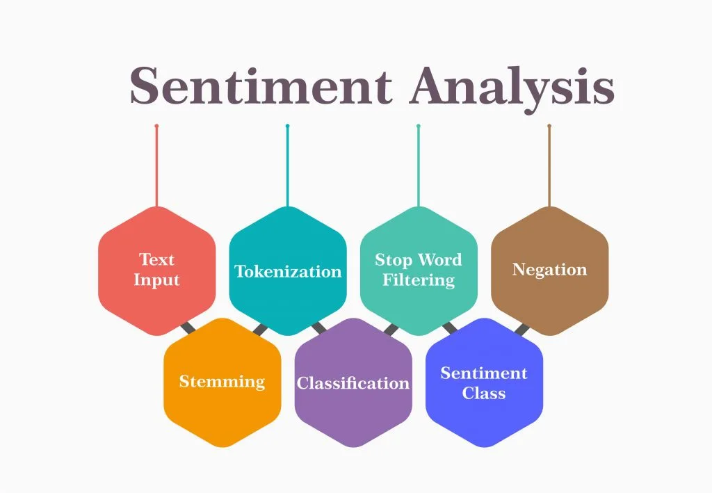

<h1 align="center">Sentiment Analysis</h1>

    Wanted to analyse the sentiment of the texts whether they meant positive or negative  ?? No Problem, You can analyse the sentiment of the Text / Reviews now. 💡   
    Wanted to visualize the postive and negative words of the sentence ?? Now you it's in your hands, Visualize the positive and negative sentiment words of the sentence.  

    
<!-- ABOUT THE PROJECT -->
##  About The Project

Sentiment analysis on reviews of the movie from the imdb movie review Dataset using concepts like 

 <ul> <li> BagOfWords(BOW) </li>
 <li> Tf-idf(Term Frequency- Inverse Document Frequency)</li>
 <li>  Word2Vec</li> </ul>

##  Features
 * Predict the sentiment of the review / text.
 * Get the postive words involved in the sentence in form of wordcloud
 * Get the negative words involved in the sentence in form of wordcloud

 ##  Tech Stack
 * Numpy
 * Pandas
 * Nltk
 * Scikit-Learn
 * gensim
 * Tqdm

## 🏅 Accuracy Results

<h3>Bag Of Words</h3>
<b>Naive-Bayes</b> - 83.872% ~ (84%)  
<b>Random Forest</b> - 83.96% ~ (84%)

<h3>Tf-idf</h3>
<b>Naive-Bayes</b> - 84.48%  
<b>Random Forest</b> - 84.14%

<h3>Word2Vec</h3>
<b>Naive-Bayes</b> - 77%  
<b>Random Forest</b> - 83.23%
